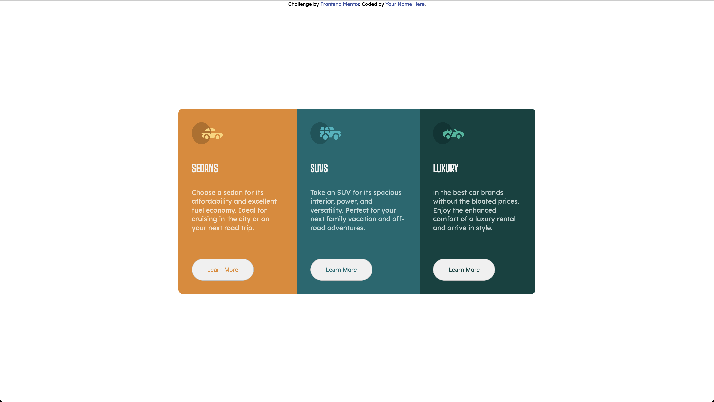
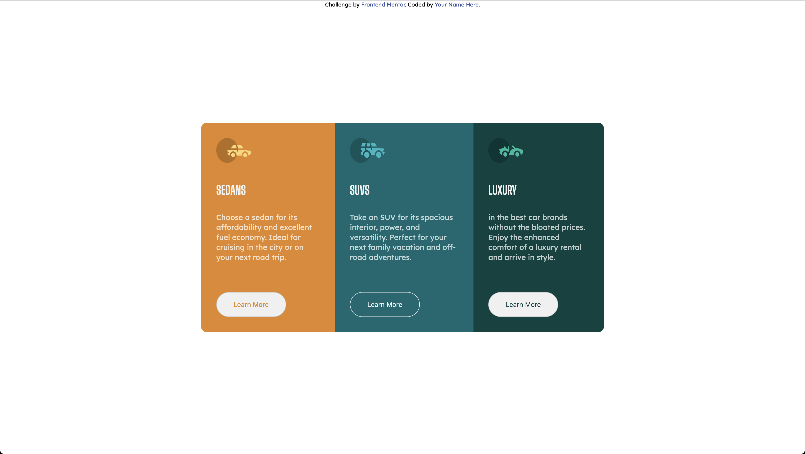

# Frontend Mentor - 3-column preview card component solution

This is a solution to the [3-column preview card component challenge on Frontend Mentor](https://www.frontendmentor.io/challenges/3column-preview-card-component-pH92eAR2-).

## Table of contents

  - [The challenge](#the-challenge)
  - [Screenshot](#screenshot)
- [My process](#my-process)
  - [Built with](#built-with)
- [Author](#author)

### The challenge

Users should be able to:

- View the optimal layout depending on their device's screen size
- See hover states for interactive elements

### Screenshot

### Links

- Solution URL: [Solution Repository](https://github.com/dellannie/3-column-preview-card-component-main.git)
- Live Site URL: [Solution Website](https://dellannie.github.io/3-column-preview-card-component-main/)

## My process
My process behind this challenge was to start by figuring out how to control each box on its own without doing too much to make the challenge complicated. I choose to use flexbox and put the three main box inside of a container to and work on each box seperate from the other. In the end I group some of the elemts together to use less CSS code instead of having all the CSS seperate for each box.

### Built with

- CSS 
- Flexbox
- Mobile-first workflow

## Author

- Website - [LinkedIn](https://www.linkedin.com/in/corey-rodney/)
- Frontend Mentor - [@dellannie](https://www.frontendmentor.io/profile/yourusername)
- Twitter - [@whatzupcorey](https://www.twitter.com/whatzupcorey)

